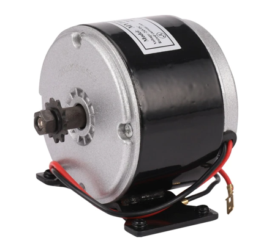

# DIY Sim Wheel
## Purpose
The purpose of this project is to make a powerful sim racing wheel cheaply (also i like doing this kind of stuff). But accualy the main reason i started this project was that i didn't want to buy a logitech g29 (g29 because it is the most common, known, reliable and cheap model on the market). Because the g29 was made of too much plastic, the torque was not at the level i wanted and the size of the steering wheel was not enough for me. That's why i focused on these issues in my own design. Below you can find all the details of the steering wheel.
## Motor
To be honest, when i started the project, i didn't want to make a design like the one below. I had in mind to make a direct drive sim wheel by purchasing a stepper motor with an encoder and a stepper motor driver. However, since the prices of these parts were higher ($110 for stepper motor and $110 for driver) and i couldn't see an example of a sim wheel made using with stepper motor, i decided to make this project with the motor below. My advice to you is that if you don't have a budget problem and still want to make your own sim wheel, you should continue with a servo motor. If I had used such a motor, i wouldn't have bothered with the gears, shaft or frame in this project.  
As an motor, i chose this motor which is originally used in scooters.  
  
Brushed DC motor. Model: MY1025  
Works with 24V and 14A (so its 250W). Also 2750RPM (actually, what i paid attention to was not the rpm but the torque).  
I think this motor will be powerful enough for the steering wheel. If you want, you can do the project by using 2 smaller motor or even using 2 of this motor. Although i didn't need such a thing.
## Power Supply
When choosing a power supply, i preferred a 24V and 15A power supply. Since the motor is 250 watt, the watt of the power supply should be slightly higher (in this case 300W).  
  
## Gears
There are 4 gears in the steering wheel, one between the shaft and the motor and one between the shaft and the encoder. I recommend that you make sure that the gears are made of aluminum so that you can drill the holes and that they are not too heavy. Even though the gears were made of aluminum, the most challenging part of this project was the holes i drilled to mount the gears on the shaft. These gears mounted on the shaft should not be fixed with any gaps in order to ensure a healthy transmission. My method of fixing them was to drill screw holes in the gears and flatten the areas where the screws were tightened on the shaft to prevent them from slipping.  
**Components for the motor:**  
60-5M-25-AL (on the shaft)  
12-5M-25-AL (on the motor)  
410-5M-25 (pulley)  
The torque produced by the motor itself was around 0.87 nm. With the 60/12 gear ratio, this value was multiplied by 5, theoretically reaching 4.35 nm (i did not measure this value experimentally). This value is approximately twice that of the Logitech G29.  
**Components for the encoder:**  
12-3M-09-AL (on the encoder)  
30-3M-09-AL (on the shaft)  
192-3M-09 (pulley)  
Since the encoder itself will not transfer any torque and will only rotate the sensor, i did not feel the need to use a stronger belt as in the encoder. The encoder was reading 600 times in 1 turn. With the 12/30 gear ratio, this value increased by 2.5 times. Now the encoder is reading 1500 times in 1 turn. You can interpret this value as reading 1 every 0.25 degrees of steering wheel rotation, which is quite sufficient.  
  
Table of pulleys for size 3M-09. Unfortunately i couldn't find the one for 5M-25.  
## Other Hardwares

## Frame

## Electronics

## Design
I made the entire design using solidworks. You can find these files in the solidworks files section.  
The thing i paid particular attention to in the design was that the shaft passes through the middle of the case. If I hadn't paid attention to this, the width of the cage could have been smaller.  
I also found the gear diameters and belt lengths I determined thanks to this program.  
## Assembly

## Pedal Shifters
The reason i opened a separate title for the pedal shifter was that i decided to add it to the steering wheel after the whole project was finished. So you don't have to do this part if you don't want to.  
## Wiring Diagram

## Software
Actually the first software i ran was the wheelconfig program but i couldn't get the system to work using this program. Also this program has a more complex schematic. That's why i preferred EMC software.  
The only thing i didn't do myself in this project and copied directly was the software. That's why i won't show how to set up the program, transfer it to arduino and make settings here. You can use the videos i put below to do these.  
  
After installing the software, everything that needs to be done about the steering wheel is finished.  
## Cost
In this section, i will write the prices of the pieces in turkish lira. Since my purpose in doing my projects is completely up to my enjoyment, they are spread over a long period of time like 1-2 years. That's why prices and exchange rates are variable, but as of the date i did the project, you can think of 1 dollar as 30-40 turkish lira.  
Motor: 1700 tl  
Power supply: 600 tl  
Steering wheel: 1500 tl  
Encoder: 550 tl  
Arduino: 400 tl  
BTS7960b: 200 tl  
Gears: 1000 tl  
Other hardwares: 1000 tl  
Other electranics: 500 tl  
Total: 7450 tl  
Half price of g29.
## Sources
Below are the videos that i watched to gain information when starting this project. I recommend that you watch them too.  
https://youtu.be/hbCjbCfUp0g?si=NynA37pT9rn3MCQu (special thanks to this video)  
https://youtu.be/FUZKslSwfaw?si=WwYVih52zpUwfXec  
https://youtu.be/L-FAyA0VQVQ?si=nJCx8VnmU1xidO3N  
https://youtu.be/nPorcXRC3Ns?si=enejoyd5WoKqs4ha  
https://youtu.be/aYYAbcPKN8g?si=kRVGH3cPVwXVqP0q  
https://youtu.be/gG_dbnKfH5Q?si=5sSKj9XNKsQQZj4X (example using stepper motor)  
https://youtu.be/_h417VxFmWQ?si=Obe5oXemXU2WvnzE (example using servo motor)  
## Conclusion
This project was an adventure that gave me a lot of knowledge while doing it (i can't say that i enjoyed it during the process). It was much more solid, powerful, cheap and high quality compared to other steering sets on the market. I hope i could contribute to your own projects. If you have any questions about the project, don't hesitate to ask me.  
